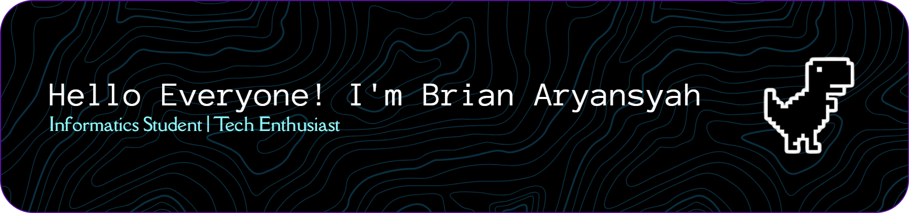

---

### Hi there! I'm **Brian Aryansyah Pamungkas**

---

## About Me

My name is Brian Aryansyah Pamungkas, a 4th Semester Informatics student at Universitas Dian Nuswantoro (UDINUS). Passionate about turning ideas into reality through code, with a strong focus on Web Development and Software Engineering. Currently sharpening skills in Frontend Development and UI/UX Design to craft clean, user-friendly digital experiences. Always open to collaboration, new challenges, and expanding knowledge in the ever-evolving tech world. Strongly believes that every line of code is a new way of thinking to solve problems.

---

## Skills & Technologies

| Languages | Frontend & Design |
|:---------:|:-----------------:|
|      |    |

---

## Let's Connect

---

*"First, solve the problem. Then, write the code."* — John Johnson

